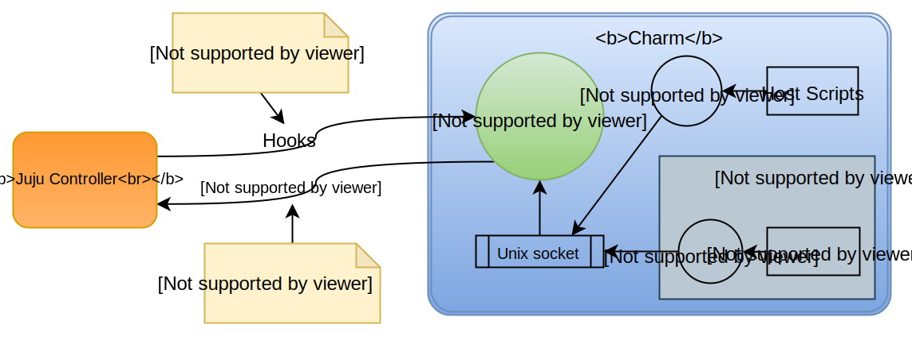

# Design

The Lucky framework will be implemented in Rust and will consist of a daemon that runs as a part of the charm and a CLI that will be used by scripts to communicate to the daemon. The overall design can be seen in the diagram below.

To explain how the design works we will go through the different components step by step.

## Hooks

Just like every Juju charm, charms built with the Lucky framework implement a number of different hooks that the Juju controller will execute. These hooks will not be implemented by the developer but will be provided by the Lucky charm template.

### Install

The install hook will first download one of our automated builds of the Lucky framework, which will be a standalone Rust executable. The install hook will be sure to download the binary appropriate to the platform architecture.

After downloading the Lucky binary it will run the Lucky daemon. The Lucky binary also acts as the CLI that is used to communicate with the running daemon. The install hook will use this CLI to tell the daemon to execute the developer's install hooks. This will be explained in more detail later.

### Other Hooks

All of the other hooks are scripts that simply use the Lucky CLI to notify the Lucky daemon of the hooks execuion and of the environment variables that came with the hook execution. It is then the Lucky daemon's job to trigger the appropriate user scripts.

> **Note:** On a somewhat related note, in the event that something goes wrong that somehow kills the daemon process, when the next hook is triggered by Juju, the CLI will detect that the daemon has stopped and will start it again before notifying the newly started daemon of the triggered hook.

## The Lucky Daemon

The Lucky daemon will be run by the charm install hook and will continue running for the whole duration that the charm is installed. The daemon will listen on a Unix socket for commands that will be sent to it by the Lucky CLI. The Lucky daemon and CLI are provided by the same binary.
